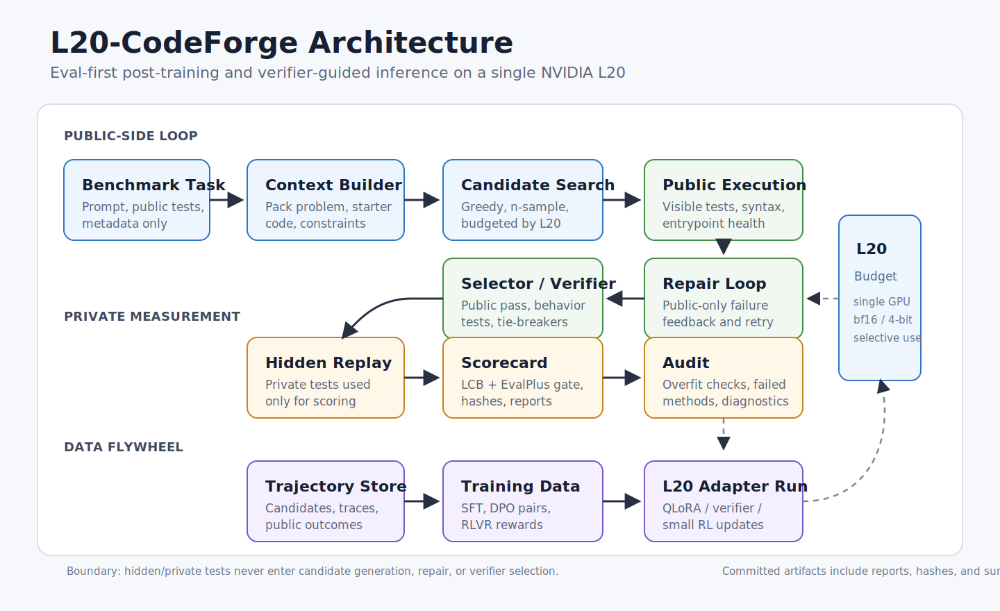

# L20-CodeForge

[](https://github.com/Kevin-Li-2025/L20-CodeForge/actions/workflows/ci.yml)

Single-L20 post-training, verifier-guided inference, and executable benchmark
infrastructure for code models.

L20-CodeForge is an eval-first research stack for making a small GPU budget
produce measurable coding capability. The project focuses on the pieces that
matter in real post-training work: clean benchmark protocol, public/private test
separation, candidate generation, repair, verifier experiments, trajectory data,
and negative-result audits.

Status: the repository currently demonstrates strong system-level gains on
public benchmarks. It does not yet claim a +15 point greedy model-weight
improvement over the base model.

Core docs: [Reproducibility](REPRODUCIBILITY.md) and
[Architecture](docs/ARCHITECTURE.md).

## Results

| Benchmark | Base model / checkpoint | Protocol | Baseline | L20-CodeForge result | Delta | Artifact |
| --- | --- | --- | ---: | ---: | ---: | --- |
| LiveCodeBench `release_v6` full suite | `Qwen2.5-Coder-7B-Instruct` | `temperature=0.8`, `n=8`, public-test selection, hidden replay | `297/1055` (`28.15%`) greedy | `403/1055` (`38.20%`) | `+106` tasks, `+10.05` points | `benchmarks/livecodebench_full_release_v6_2026_05_22/` |
| EvalPlus HumanEval+ | `Qwen2.5-Coder-7B-Instruct` | clean public-signal system, official EvalPlus scoring | `84.8%` greedy | `92.7%` | `+7.9` points | `benchmarks/evalplus_l20_codeforge_2026_05_22/` |
| EvalPlus MBPP+ | `Qwen2.5-Coder-7B-Instruct` | clean public-signal system, official EvalPlus scoring | `72.2%` greedy | `81.7%` | `+9.5` points | `benchmarks/evalplus_l20_codeforge_2026_05_22/` |
| X-Coder medium `control12` | `IIGroup/X-Coder-RL-Qwen2.5-7B` | strict code generation, public-only repair, one public-feedback round | `0/12` auto/strict starter-prefix checks | `4/12` | `+4` tasks | `docs/MILESTONE_9_XCODER_L20_PLUS15_PROBE.md` |

Cross-benchmark guardrail: `benchmarks/generalization_scorecard_2026_05_23/`
records a `PASS` gate over full LiveCodeBench plus EvalPlus HumanEval+/MBPP+.

## Benchmark Artifact Hashes

| Artifact | SHA-256 |
| --- | --- |
| `benchmarks/generalization_scorecard_2026_05_23/scorecard.json` | `1eb0402378ea25732225b29d7ba367b6111ab3351e54cc7c01fa7646a7a12712` |
| `benchmarks/livecodebench_full_release_v6_2026_05_22/full_n8_public_select_summary.json` | `2a0ff919aa15eb9ecdf74824f7bf790a23f6d0197ef74970b6190c60e0e00772` |
| `benchmarks/evalplus_l20_codeforge_2026_05_22/summary.csv` | `08732bbb76450f92ef3c02fa97a163aba01f71028365072c205c5a3af45d5550` |

See [REPRODUCIBILITY.md](REPRODUCIBILITY.md) for the full hash-verification
command and expected output.

## Claim Boundary

- The LiveCodeBench and EvalPlus numbers above are system-level results unless a
  row explicitly says greedy model baseline.
- Public tests, public examples, and public prompt metadata may be used for
  candidate selection and repair. Hidden/private tests are reserved for final
  measurement and audits.
- This is not an official leaderboard submission. It is a reproducible local
  checkpoint with saved generations, reports, hashes, and protocol notes.
- Targeted probes, such as first-12 rescues or code-prefix experiments, are not
  presented as broad benchmark results.
- The current +15 goal is still open: the next milestone is to turn
  system-level gains into a cleaner greedy or single-sample model-capability
  improvement without overfitting to visible tests.

## What This Project Builds

L20-CodeForge is organized around one constraint: a single NVIDIA L20 should be
enough to run a serious coding post-training loop if the loop is selective,
measured, and executable.



The repository contains:

- LiveCodeBench and EvalPlus evaluation harnesses with saved reports.
- Public-test selection, repair, and behavior-test tooling.
- Candidate health audits for syntax, entrypoint, and execution failure modes.
- A trajectory schema for repo-repair agents and model training data.
- SFT, DPO, reward-function, and GRPO/RLVR scaffolding.
- Single-L20 setup scripts and GPU sanity checks.

## Quickstart

Local development:

```bash
python3 -m venv .venv
source .venv/bin/activate
python -m pip install -e ".[dev,bench]"
python -m pytest -q
python -m l20_codeforge profile
python -m l20_codeforge smoke-loop
```

The `python -m pytest -q` line should print:

```text
135 passed in <time>s
```

On an L20 host:

```bash
bash scripts/bootstrap_remote.sh
source .venv/bin/activate
python scripts/check_gpu.py
python -m pytest -q
```

The bootstrap script creates an isolated Python environment, installs a CUDA
PyTorch stack, and installs this package with training and development
dependencies. It does not download large model weights.

## Reproducing The Reported Checkpoints

Build the cross-benchmark scorecard:

```bash
python scripts/build_generalization_scorecard.py \
  --output-dir benchmarks/generalization_scorecard_2026_05_23
```

Expected output includes:

```json
{
  "status": "PASS",
  "checks": [
    {
      "name": "lcb_overall_improves",
      "value": 0.100474,
      "threshold": 0.0,
      "passed": true
    }
  ]
}
```

Re-run the packaged EvalPlus scoring:

```bash
python -m l20_codeforge eval-evalplus humaneval \
  benchmarks/evalplus_l20_codeforge_2026_05_22/samples/humaneval.mixed-target.literal-combined.public-consensus-selected.samples.jsonl \
  --output /tmp/humaneval_recheck.json \
  --parallel 8

python -m l20_codeforge eval-evalplus mbpp \
  benchmarks/evalplus_l20_codeforge_2026_05_22/samples/mbpp.temp08.n5-plus-basefallback-n30.public-consensus-shortest-selected.samples.jsonl \
  --output /tmp/mbpp_recheck.json \
  --parallel 8
```

LiveCodeBench full-suite reproduction requires a local materialized
`release_v6` JSONL with private tests. That file is intentionally not committed.
The committed package includes saved generations, compact summaries, hashes,
and evaluator outputs. See
`benchmarks/livecodebench_full_release_v6_2026_05_22/README.md` for the full
generation and replay commands.

## Key Artifacts

| Path | Purpose |
| --- | --- |
| `benchmarks/generalization_scorecard_2026_05_23/scorecard.json` | Machine-readable LCB + EvalPlus gate. |
| `benchmarks/livecodebench_full_release_v6_2026_05_22/full_n8_public_select_summary.json` | Headline full LCB `n=8` public-selection result. |
| `benchmarks/livecodebench_full_release_v6_2026_05_22/README.md` | Full LCB protocol, hashes, breakdowns, and commands. |
| `benchmarks/evalplus_l20_codeforge_2026_05_22/summary.csv` | EvalPlus greedy baselines and clean system rows. |
| `docs/MILESTONE_8_LCB_PLUS15_FOCUS.md` | Research plan for converting system gain into model-capability gain. |
| `docs/MILESTONE_9_XCODER_L20_PLUS15_PROBE.md` | X-Coder probe, control slices, positive results, and overfitting checks. |
| `scripts/evaluate_lcb_generations.py` | Hidden replay, public selection, behavior-input selection, and variable-candidate handling. |
| `scripts/regenerate_lcb_final_answers.py` | Second-pass code regeneration with optional public-test feedback. |
| `src/l20_codeforge/` | Package code for data, envs, evals, rewards, inference, training, and GPU profiling. |

## What Worked

- Full-suite `n=8` public-test selection moved Qwen2.5-Coder-7B-Instruct from
  `297/1055` to `403/1055` on LiveCodeBench `release_v6`.
- EvalPlus clean public-signal systems improved HumanEval+ and MBPP+ without
  using EvalPlus extra tests for selection.
- One public-feedback repair round on the X-Coder medium control slice lifted
  the gate from `2/12` after public-only repair to `4/12`.
- The evaluation harness caught optimistic small-subset results and forced the
  project onto full-suite and cross-benchmark scorecards.

## What Failed

These failures are kept in the repository because they are useful research
signal, not noise.

- Small LiveCodeBench subsets were optimistic relative to the full 1,055-task
  suite.
- Automatic starter-prefix prompting did not generalize on the medium
  `control12` slice (`0/12`).
- Multi-source code-only repair did not improve the medium fail10 slice.
- A second public-feedback repair round produced public-test signal but `0/8`
  hidden passes, which is an overfitting warning.
- Input-only adaptive differential tests had little leverage when the candidate
  pool lacked multiple public-passing alternatives.
- The first expected-output verifier pass regressed the targeted replay, so it
  needs calibration or a stronger verifier before it can affect headline runs.

## Repository Layout

```text
configs/                 L20-first experiment configs
docs/                    architecture notes, milestones, and runbooks
scripts/                 benchmark, repair, audit, setup, and GPU utilities
src/l20_codeforge/
  agents/                mini-SWE-agent trajectory adapter
  context/               repo context packing
  data/                  task, trajectory, SFT, and preference builders
  envs/                  local repo execution adapters
  evals/                 EvalPlus, patch, SFT, and eval-card tooling
  gpu/                   L20 profile and memory policy
  inference/             candidate selectors
  rewards/               executable and patch-quality reward functions
  training/              SFT and TRL-compatible reward helpers
tests/                   unit and regression tests
benchmarks/              committed benchmark packages and audit outputs
```

## Current Roadmap

1. Build mined verified algorithm-prefix data from public failures, while
   excluding exact LiveCodeBench prompts from training data.
2. Train or calibrate an expected-output verifier before allowing generated
   behavior tests to change headline selections.
3. Improve the X-Coder medium `control12` gate from `4/12` to `6/12+` with an
   automatic method, then scale to broader LCB slices.
4. Add a small QLoRA/SFT adapter only after the data path beats prompting and
   repair on held-out control slices.
5. Keep the generalization scorecard as the release gate for every benchmark
   claim.

## References

- LiveCodeBench: https://livecodebench.github.io/
- EvalPlus: https://github.com/evalplus/evalplus
- Qwen2.5-Coder: https://qwenlm.github.io/blog/qwen2.5-coder-family/
- X-Coder model card: https://huggingface.co/IIGroup/X-Coder-RL-Qwen2.5-7B
- TRL GRPO trainer: https://huggingface.co/docs/trl/grpo_trainer
- mini-SWE-agent: https://github.com/SWE-agent/mini-swe-agent
- SWE-bench: https://www.swebench.com/
